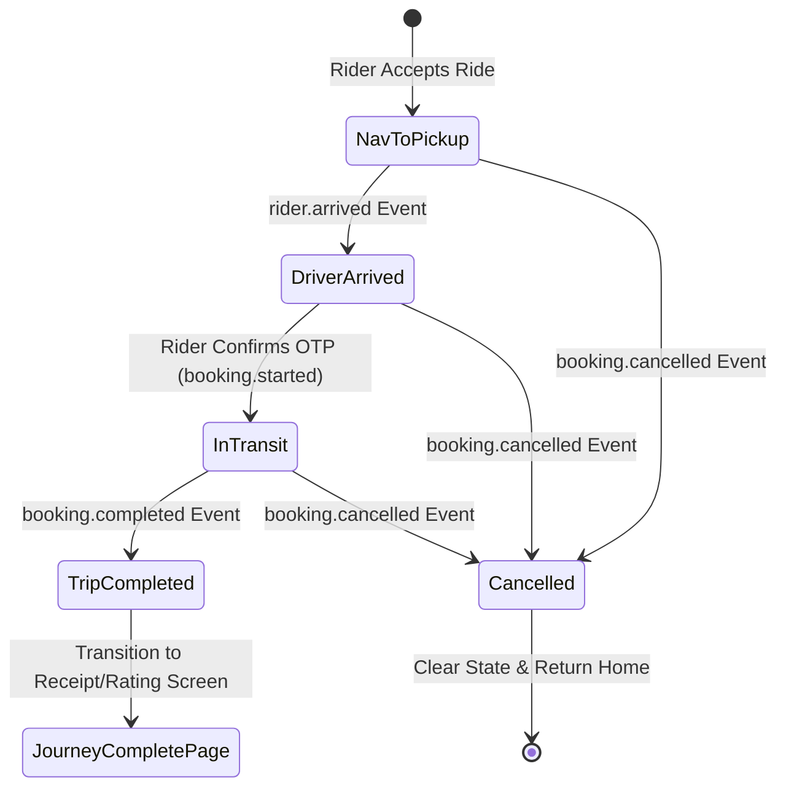

# Customer Live Trip Map & Navigation Flow

This document details the complete technical flow, state transitions, state management, map pointers/markers, "Track Vehicle" button logic, socket contracts, and UI components for the **Customer Live Trip Map** in the `wheels_user` Flutter application.

---

## 1. Overview & Architecture

The Customer Live-Trip Map displays real-time driver progress, OSRM turn-by-turn road geometry, ETA updates, map pointers/markers, and active trip actions.

### Architectural Layers
- **Presentation Layer**:
  - `LiveTripTrackingPage`: Primary live map screen featuring an interactive `GoogleMap`, floating top ETA card, minimizable bottom sheet, map pointers, and action controls.
  - `BookingConfirmedPage`: Intermediate screen shown after booking acceptance; features the "Track Vehicle" button and automatically transitions to `LiveTripTrackingPage` upon OTP confirmation.
  - `HomePage`: Hosts embedded live tracking navigation inside the main Home tab when a trip is active.
- **State Management & Services**:
  - `ActiveBookingService`: Centralized singleton tracking active trip state (`RIDER_ACCEPTED`, `DRIVER_ARRIVED`, `TRIP_STARTED`, `COMPLETED`).
  - `CustomerWSController`: WebSocket controller emitting real-time driver position and lifecycle events (`rider.location`, `booking.started`, `booking.arrived`, `booking.completed`).
  - `NavigationService`: Fetches real road-accurate OSRM geometry points and distance/duration matrices.

---

## 2. Trip Lifecycle & State Machine

The map transitions through 4 distinct phases based on authoritative backend WebSocket events:



| Phase (`TripPhase`) | Trigger Event | Customer Wording | Route Polyline Geometry | ETA & Distance Meaning |
| --- | --- | --- | --- | --- |
| **`navToPickup`** | `booking.rider_accepted` | `DRIVER ARRIVING AT PICKUP` | Driver current position $\rightarrow$ Pickup Location (ABC) | Minutes & distance remaining until pickup |
| **`driverArrived`** | `booking.arrived` | `DRIVER HAS ARRIVED` | Driver & Pickup clearly displayed | Displays `Arrived` / `At Pickup` |
| **`inTransit`** | `booking.started` (OTP Confirmed) | `EN ROUTE TO DESTINATION` | Driver current position $\rightarrow$ Destination (XYZ) | Minutes & distance remaining until destination |
| **`tripCompleted`** | `booking.completed` | `TRIP COMPLETED` | Clears active state | Navigates to `JourneyCompletePage` |

---

## 3. Map Pointers & Location Markers

The map view renders 3 distinct high-resolution markers (pointers) to visually indicate positions:

```
[ Rider Vehicle Pointer ] ---> [ Pickup Pin (ABC) ] ---> [ Destination Pin (XYZ) ]
 (Rotating Car Icon)            (Green / Azure Pin)             (Red Pin)
```

1. **Rider Vehicle Marker Pointer (`moving_vehicle`)**:
   - Custom high-resolution vehicle cursor generated via `PictureRecorder` canvas (`_carMarkerIcon`).
   - Dynamic rotation angle (`_currentVehicleRotation`) computed using spherical bearing between previous and updated coordinates.
   - Configured with `flat: true` and `anchor: Offset(0.5, 0.5)` for smooth, realistic car motion on roads.

2. **Pickup Location Marker Pointer (`pickup`)**:
   - Azure/Green pin marker (`_pickupMarkerIcon`) at `widget.pickupLatLng`.
   - InfoWindow displays `Pickup Location (ABC)`.

3. **Destination Location Marker Pointer (`drop`)**:
   - Red pin marker (`_dropMarkerIcon`) at `widget.dropLatLng`.
   - InfoWindow displays `Destination (XYZ)`.

---

## 4. "Track Vehicle" Button & Navigation Trigger Logic

Navigating to the live map screen occurs via two distinct user flows (Manual Button Tap & Automatic Socket Event):

### A. Manual "Track Vehicle" Button Taps
1. **From Booking Confirmation Screen (`BookingConfirmedPage`)**:
   - The user taps the primary **"Track Vehicle"** button (`ElevatedButton` with `Icons.track_changes_rounded`).
   - Executes `Navigator.of(context).push(MaterialPageRoute(builder: (_) => LiveTripTrackingPage(...)))`.
2. **From Home Screen Active Ride Banner (`HomePage`)**:
   - If an active ride exists, `HomePage` displays the `ACTIVE RIDE IN PROGRESS` banner.
   - Tapping **"Go to Active Ride"** navigates directly to `LiveTripTrackingPage`.

### B. Automatic Navigation Trigger (Rider OTP Verification)
- When the rider enters and verifies the start OTP on the rider app:
- Backend emits the `booking.started` / `rider.trip_started` WebSocket event to `CustomerWSController`.
- `BookingConfirmedPage` listens to `bookingEventStream`.
- Upon receiving `booking.started`, `BookingConfirmedPage` **automatically** executes `Navigator.of(context).pushReplacement(...)` to directly open `LiveTripTrackingPage` (no manual tap required).

---

## 5. Map Work & Navigation Mechanics

### A. Visible OSRM Road Polyline
- Prominent blue route polyline (`#0D6EFD`, width 6, `JointType.round`, `Cap.roundCap`).
- Updates dynamically depending on active phase:
  - **Phase 1 & 2**: Route connects Rider Vehicle $\rightarrow$ Pickup Location (ABC).
  - **Phase 3**: Route connects Rider Vehicle $\rightarrow$ Destination (XYZ).

### B. Uninterrupted Camera Motion (No Camera Jumping)
- **Root Cause Fixed**: Previously, asynchronous route fetches called `_fitMapBounds()` repeatedly on every location update, overriding vehicle follow camera.
- **Current Motion Logic**:
  - **Vehicle Follow Mode (`_isFollowingVehicle == true`)**: Camera smoothly follows `_currentVehiclePos` as new WebSocket location updates arrive without jumping.
  - **Route Overview Mode (`_isFollowingVehicle == false`)**: Triggered when the user manually taps the **Route Overview** button (`Icons.map_rounded`), zooming out to fit all route bounds (`LatLngBounds`).
  - **Recenter Button (`Icons.my_location_rounded`)**: Restores Vehicle Follow Mode.

---

## 6. Key UI Components & Interactions

### A. Collapsible / Minimizable Tracking Sheet
- **Component**: `DraggableScrollableSheet` with `DraggableScrollableController`.
- **Snap Positions**:
  - **Minimized (`14%` Height)**: Collapses the sheet down to expose 86% of the map screen, displaying driver avatar, name, rating, vehicle model, OTP pill, and Call/Chat buttons.
  - **Default (`45%` Height)**: Mid-height view showing location timeline (Pickup $\rightarrow$ Destination) and emergency actions.
  - **Expanded (`85%` Height)**: Full details view.
- **Interactive Drag Handle**: Tapping the top pill handle smoothly animates between minimized (`0.14`) and expanded (`0.45`) states.

### B. Floating Top Status & ETA Banner
- Displays phase label (`DRIVER ARRIVING AT PICKUP`, `EN ROUTE TO DESTINATION`).
- Formatted Duration & Distance:
  - Distances below `0.1 mi` render in meters (e.g. `250 m`).
  - Arrival state shows `Arrived` / `At Pickup` instead of `0 mins`.
- ETA clock time (e.g. `14:45`).

### C. Stale Location Warning Banner
- Detects driver GPS fix delay exceeding 15 seconds.
- Displays warning banner: `Updating location... (Driver connection weak)`.

---

## 7. WebSocket Payload Contracts

The customer app listens to `CustomerWSController.bookingEventStream`:

### 1. Driver Live Location (`rider.location` / `rider.location_updated`)
```json
{
  "event": "rider.location",
  "data": {
    "lat": 17.4126,
    "lng": 78.3498,
    "heading": 180.0
  }
}
```

### 2. Driver OTP Start Confirmation (`booking.started` / `rider.trip_started`)
```json
{
  "event": "booking.started",
  "data": {
    "bookingId": "ER-9921-X4B",
    "status": "TRIP_STARTED"
  }
}
```

### 3. Trip Completion (`booking.completed`)
```json
{
  "event": "booking.completed",
  "data": {
    "bookingId": "ER-9921-X4B"
  }
}
```

---

## 8. File Mapping & Implementation References

| File Path | Description |
| --- | --- |
| [live_trip_tracking_page.dart](file:///d:/projects/live_projects/StriveWheels/wheels_user/lib/features/booking/presentation/pages/live_trip_tracking_page.dart) | Core customer live map, map pointers, OSRM route fetcher, minimizable bottom sheet, and socket listener. |
| [booking_confirmed_page.dart](file:///d:/projects/live_projects/StriveWheels/wheels_user/lib/features/booking/presentation/pages/booking_confirmed_page.dart) | Confirmation screen with "Track Vehicle" button; auto-replaces with `LiveTripTrackingPage` on OTP verification. |
| [home_page.dart](file:///d:/projects/live_projects/StriveWheels/wheels_user/lib/features/home/presentation/pages/home_page.dart) | Embeds `LiveTripTrackingPage` directly into the Home tab when `status == 'TRIP_STARTED'`. |
| [active_booking_service.dart](file:///d:/projects/live_projects/StriveWheels/wheels_user/lib/core/services/active_booking_service.dart) | Centralized state persistence for active bookings across app restarts. |

---

## 9. Verification Checklist

- [x] High-resolution car marker pointer rotates dynamically with driver bearing.
- [x] Pickup (Green) and Destination (Red) location marker pointers clearly displayed.
- [x] Manual "Track Vehicle" button opens live map tracking view.
- [x] Automatic navigation triggers when rider confirms OTP on rider side.
- [x] OSRM turn-by-turn road polyline rendered in prominent blue (`#0D6EFD`).
- [x] No camera jumping back and forth on WebSocket location updates.
- [x] Minimizable bottom card snaps between 14%, 45%, and 85% height.
- [x] Android bottom system navigation bar safe-area insets preserved.
- [x] Unit tests passing for `ActiveBookingService` and `NavigationService`.
