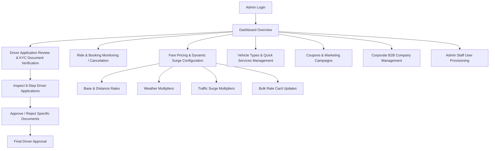

# Strive Admin Panel - Workflow & API Technical Specifications

This comprehensive technical specification document defines the **Admin Workflows**, **System Architecture**, and complete **REST API Endpoints** required to build a modern, high-performance **React.js / Next.js Admin Panel** for the **Strive Mobility & Transport Platform**.

---

## 1. Architecture & General Technical Standards

### 1.1 Technology Recommendation for React.js / Next.js Admin Panel
* **Framework**: Next.js 14+ (App Router with Server Components & Client Components) or React.js with Vite.
* **UI Components & Styling**: Tailwind CSS, Shadcn UI / Radix UI / Ant Design / Material UI for data tables, modals, forms, and charts.
* **State Management & Data Fetching**: TanStack Query (React Query v5) for API state, caching, pagination, and invalidation + Zustand for local UI state (auth token, sidebar toggle, theme).
* **HTTP Client**: Axios with Request & Response Interceptors for JWT authentication and automatic token refresh.

### 1.2 Base URL & Environment Config
* **Base URL**: `http://localhost:8000/api/v1` (Development) / `https://api.strive.com/api/v1` (Production)
* **Default Content-Type**: `application/json`
* **Authorization Header**: `Authorization: Bearer <access_token>`

### 1.3 Standard API Response Wrapper Structure (`ApiResponse<T>`)
All backend endpoints return responses wrapped inside a unified JSON envelope:

#### Standard Success Response
```json
{
  "success": true,
  "message": "Operation completed successfully",
  "data": { ... },
  "meta": null
}
```

#### Standard Error Response
```json
{
  "success": false,
  "message": "Invalid credentials or unauthorized access.",
  "data": null,
  "error": {
    "code": "UNAUTHORIZED",
    "details": null
  },
  "meta": null
}
```

---

## 2. Admin User Flows & System Architecture



### Key Workflows
1. **Authentication Flow**:
   - Admin logs in via `/api/v1/auth/admin/login` using `email_or_phone` and `password`.
   - Backend issues short-lived `access_token` and long-lived `refresh_token`.
   - React Interceptor stores `access_token` in memory/cookies and automatically invokes `/api/v1/auth/refresh` on `401 Unauthorized`.
2. **Driver Onboarding & 9-Step KYC Verification Flow**:
   - Admin views submitted driver applications at `/api/v1/admin/driver-registrations`.
   - Admin opens detailed view `/api/v1/admin/driver-registrations/{id}` to inspect Personal details, Address, KYC documents (Aadhaar, PAN, DL), Vehicle docs (RC, Insurance, PUC), and Bank account.
   - Admin marks individual documents as `APPROVED` or `REJECTED` with specific rejection reasons.
   - Once verified, Admin triggers `/api/v1/admin/driver-registrations/{id}/review` to set overall status to `APPROVED`.
3. **Ride & Booking Control Flow**:
   - Admin monitors live and scheduled rides at `/api/v1/admin/bookings` with filters (`status`, `service_mode`, `booking_mode`, `search`).
   - Admin can view complete trip breakdown or cancel an active ride using `/api/v1/admin/bookings/{id}/cancel`.
4. **Fare Pricing Engine & Surge Multiplier Flow**:
   - Admin sets base rate card per vehicle type via `/api/v1/admin/fare-configs`.
   - Bulk updates for emergency surge or distance rate changes using `/api/v1/admin/fare-configs/bulk`.
   - Dynamic environmental surges managed via Weather (`/api/v1/admin/weather-fares`) and Traffic (`/api/v1/admin/traffic-fares`) multipliers.

---

## 3. Comprehensive REST API Endpoints Specification

---

### Module 1: Admin Authentication (`/api/v1/auth`)

#### 1.1 Admin Staff Login
* **Method**: `POST`
* **Endpoint**: `/api/v1/auth/admin/login`
* **Auth Required**: None (Public)
* **Summary**: Authenticate Admin or Super Admin user using Email/Phone and Password.

##### Request Headers
```http
Content-Type: application/json
```

##### Request Body
```json
{
  "email_or_phone": "admin@strive.com",
  "password": "SuperSecurePassword123!"
}
```

##### Response Body (200 OK)
```json
{
  "success": true,
  "message": "Admin authenticated successfully.",
  "data": {
    "access_token": "eyJhbGciOiJIUzI1NiIsInR5cCI6IkpXVCJ9...",
    "refresh_token": "eyJhbGciOiJIUzI1NiIsInR5cCI6IkpXVCJ9...",
    "token_type": "bearer",
    "expires_in": 86400,
    "user": {
      "id": 1,
      "phone": "+919876543210",
      "email": "admin@strive.com",
      "full_name": "Platform Super Admin",
      "profile_image_url": "https://cdn.strive.com/avatars/admin.jpg",
      "roles": ["SUPER_ADMIN", "ADMIN"],
      "is_active": true,
      "is_verified": true,
      "created_at": "2026-01-01T00:00:00Z"
    }
  },
  "error": null,
  "meta": null
}
```

#### 1.2 Refresh JWT Access Token
* **Method**: `POST`
* **Endpoint**: `/api/v1/auth/refresh`
* **Auth Required**: None
* **Summary**: Exchange valid refresh token for a new access token.

##### Request Body
```json
{
  "refresh_token": "eyJhbGciOiJIUzI1NiIsInR5cCI6IkpXVCJ9..."
}
```

##### Response Body (200 OK)
```json
{
  "success": true,
  "message": "Token refreshed successfully.",
  "data": {
    "access_token": "eyJhbGciOiJIUzI1NiIsInR5cCI6IkpXVCJ9...",
    "refresh_token": "eyJhbGciOiJIUzI1NiIsInR5cCI6IkpXVCJ9...",
    "token_type": "bearer",
    "expires_in": 86400
  },
  "error": null,
  "meta": null
}
```

---

### Module 2: Admin Dashboard Analytics (`/api/v1/admin/dashboard`)

#### 2.1 Get Overall Platform Statistics
* **Method**: `GET`
* **Endpoint**: `/api/v1/admin/dashboard/stats`
* **Auth Required**: `Bearer <access_token>` (`ADMIN`, `SUPER_ADMIN`)
* **Summary**: High-level platform KPIs for admin dashboard widgets.

##### Response Body (200 OK)
```json
{
  "success": true,
  "message": "Platform statistics fetched successfully.",
  "data": {
    "total_users": 15420,
    "total_customers": 12850,
    "total_riders": 2570,
    "active_drivers_online": 430,
    "active_trips_in_progress": 84,
    "completed_trips_today": 1250,
    "pending_driver_registrations": 18,
    "total_platform_revenue": 458920.50,
    "today_revenue": 34500.00
  },
  "error": null,
  "meta": null
}
```

---

### Module 3: Driver Onboarding & KYC Review (`/api/v1/admin/driver-registrations`)

#### 3.1 List Driver Applications
* **Method**: `GET`
* **Endpoint**: `/api/v1/admin/driver-registrations`
* **Auth Required**: `Bearer <access_token>` (`ADMIN`, `SUPER_ADMIN`)
* **Query Parameters**:
  * `skip` (*int*, default `0`): Pagination offset.
  * `limit` (*int*, default `50`): Page size.
  * `status` (*string*, optional): `SUBMITTED`, `IN_REVIEW`, `APPROVED`, `REJECTED`, `DRAFT`.
  * `current_step` (*int*, optional): Filter by step number (`1` to `9`).

##### Response Body (200 OK)
```json
{
  "success": true,
  "message": "Driver registrations fetched successfully.",
  "data": [
    {
      "id": 42,
      "user_id": 105,
      "status": "SUBMITTED",
      "current_step": 9,
      "progress_percentage": 100.0,
      "submitted_at": "2026-09-12T14:30:00Z",
      "personal_info": {
        "first_name": "Rahul",
        "last_name": "Sharma",
        "mobile_number": "+919030303983",
        "email": "rahul.sharma@example.com"
      },
      "vehicle_detail": {
        "company_name": "Maruti Suzuki",
        "vehicle_model": "Dzire",
        "vehicle_number": "TS09FA1234"
      }
    }
  ],
  "error": null,
  "meta": null
}
```

#### 3.2 Get Full Driver Registration Profile (Steps 1-9)
* **Method**: `GET`
* **Endpoint**: `/api/v1/admin/driver-registrations/{id}`
* **Auth Required**: `Bearer <access_token>` (`ADMIN`, `SUPER_ADMIN`)

##### Response Body (200 OK)
```json
{
  "success": true,
  "message": "Full driver registration details retrieved.",
  "data": {
    "registration_id": 42,
    "user_id": 105,
    "status": "SUBMITTED",
    "current_step": 9,
    "total_steps": 9,
    "progress_percentage": 100.0,
    "completed_steps": [1, 2, 3, 4, 5, 6, 7, 8, 9],
    "rejection_reason": null,
    "submitted_at": "2026-09-12T14:30:00Z",
    "personal_info": {
      "id": 42,
      "registration_id": 42,
      "first_name": "Rahul",
      "last_name": "Sharma",
      "mobile_number": "+919030303983",
      "email": "rahul.sharma@example.com",
      "dob": "1995-05-15",
      "gender": "MALE",
      "profile_photo_url": "https://cdn.strive.com/uploads/photo.jpg"
    },
    "address": {
      "id": 42,
      "registration_id": 42,
      "house_no": "Flat 402, Block B",
      "street_area": "Jubilee Hills Road No. 36",
      "pincode": "500033",
      "city": "Hyderabad",
      "state": "Telangana",
      "latitude": 17.4312,
      "longitude": 78.4069
    },
    "kyc_documents": [
      {
        "id": 101,
        "registration_id": 42,
        "document_type": "AADHAAR_FRONT",
        "document_number_masked": "XXXX-XXXX-9012",
        "file_url": "https://cdn.strive.com/uploads/aadhaar_front.jpg",
        "verification_status": "PENDING",
        "rejection_reason": null,
        "created_at": "2026-09-12T14:00:00Z"
      },
      {
        "id": 102,
        "registration_id": 42,
        "document_type": "DRIVING_LICENSE_FRONT",
        "document_number_masked": "DL1420110012345",
        "file_url": "https://cdn.strive.com/uploads/dl_front.jpg",
        "verification_status": "PENDING",
        "rejection_reason": null,
        "created_at": "2026-09-12T14:05:00Z"
      }
    ],
    "vehicle_detail": {
      "id": 34,
      "vehicle_type_id": 1,
      "compenyName": "Maruti Suzuki",
      "vehicalModel": "Dzire",
      "vehicalNumber": "TS09FA1234",
      "vehicalColor": "White",
      "fuelType": "PETROL",
      "seatingCapacity": 4,
      "manufactureYear": 2023
    },
    "bank_account": {
      "id": 20,
      "account_holder_name": "Rahul Sharma",
      "account_number": "9182391203912",
      "ifsc_code": "SBIN0001234",
      "bank_name": "State Bank of India"
    },
    "terms_accepted": true,
    "privacy_policy_accepted": true
  },
  "error": null,
  "meta": null
}
```

#### 3.3 Verify / Reject Individual Driver Document
* **Method**: `POST`
* **Endpoint**: `/api/v1/admin/driver-registrations/{id}/verify-document`
* **Auth Required**: `Bearer <access_token>` (`ADMIN`, `SUPER_ADMIN`)

##### Request Body
```json
{
  "document_id": 101,
  "document_category": "KYC",
  "status": "REJECTED",
  "rejection_reason": "Aadhaar image is blurry and text is not legible."
}
```

##### Response Body (200 OK)
```json
{
  "success": true,
  "message": "Document KYC #101 marked as REJECTED",
  "data": {
    "document_id": 101,
    "status": "REJECTED"
  },
  "error": null,
  "meta": null
}
```

#### 3.4 Overall Driver Registration Approval / Rejection
* **Method**: `POST`
* **Endpoint**: `/api/v1/admin/driver-registrations/{id}/review`
* **Auth Required**: `Bearer <access_token>` (`ADMIN`, `SUPER_ADMIN`)

##### Request Body (Approval)
```json
{
  "status": "APPROVED",
  "rejection_reason": null
}
```

##### Response Body (200 OK)
```json
{
  "success": true,
  "message": "Driver registration #42 has been APPROVED and activated.",
  "data": {
    "registration_id": 42,
    "status": "APPROVED",
    "rider_id": 88
  },
  "error": null,
  "meta": null
}
```

#### 3.5 Get Rider 5-Day Availability Schedule
* **Method**: `GET`
* **Endpoint**: `/api/v1/admin/riders/{rider_id}/availability-schedule`
* **Auth Required**: `Bearer <access_token>` (`ADMIN`, `SUPER_ADMIN`)
* **Query Parameters**: `start_date` (*date YYYY-MM-DD*, optional)

##### Response Body (200 OK)
```json
{
  "success": true,
  "message": "Rider availability schedule fetched successfully.",
  "data": [
    {
      "id": 12,
      "rider_id": 88,
      "date": "2026-09-15",
      "is_available": true,
      "notes": "Available for Morning Shift"
    },
    {
      "id": 13,
      "rider_id": 88,
      "date": "2026-09-16",
      "is_available": false,
      "notes": "Vehicle Maintenance"
    }
  ],
  "error": null,
  "meta": null
}
```

#### 3.6 Set Rider Availability Schedule
* **Method**: `POST`
* **Endpoint**: `/api/v1/admin/riders/{rider_id}/availability-schedule`
* **Auth Required**: `Bearer <access_token>` (`ADMIN`, `SUPER_ADMIN`)

##### Request Body
```json
[
  {
    "date": "2026-09-15",
    "is_available": true,
    "notes": "Assigned to Mindspace Shift"
  },
  {
    "date": "2026-09-16",
    "is_available": true,
    "notes": "Assigned to Mindspace Shift"
  }
]
```

##### Response Body (200 OK)
```json
{
  "success": true,
  "message": "Rider availability schedule updated successfully.",
  "data": [ ... ],
  "error": null,
  "meta": null
}
```

---

### Module 4: Booking & Ride Management (`/api/v1/admin/bookings`)

#### 4.1 List All Bookings (Paginated & Filtered)
* **Method**: `GET`
* **Endpoint**: `/api/v1/admin/bookings`
* **Auth Required**: `Bearer <access_token>` (`ADMIN`, `SUPER_ADMIN`)
* **Query Parameters**:
  * `skip` (*int*, default `0`)
  * `limit` (*int*, default `50`)
  * `status` (*string*, optional): `PENDING`, `ACCEPTED`, `ARRIVED`, `IN_TRIP`, `COMPLETED`, `CANCELLED`, `ADMIN_CANCELLED`
  * `service_mode` (*string*, optional): `NORMAL`, `OUTSTATION`, `RENTAL`, `COURIER`
  * `booking_mode` (*string*, optional): `INSTANT`, `SCHEDULED`, `RESERVED`
  * `customer_id` (*int*, optional)
  * `rider_id` (*int*, optional)
  * `search` (*string*, optional): Searches booking code, addresses, customer or rider name.

##### Response Body (200 OK)
```json
{
  "success": true,
  "message": "Bookings retrieved successfully.",
  "data": {
    "items": [
      {
        "id": 501,
        "booking_code": "STR-2026-9812",
        "customer_id": 105,
        "rider_id": 88,
        "service_mode": "NORMAL",
        "booking_mode": "INSTANT",
        "trip_type": "ONE_WAY",
        "status": "IN_TRIP",
        "pickup_address": "Inorbit Mall, Madhapur, Hyderabad",
        "pickup_lat": 17.4375,
        "pickup_lng": 78.3814,
        "drop_address": "RGIA Airport, Shamshabad",
        "drop_lat": 17.2403,
        "drop_lng": 78.4294,
        "distance_km": 32.4,
        "duration_mins": 45,
        "final_fare": 650.00,
        "created_at": "2026-09-13T08:15:00Z"
      }
    ],
    "total": 1420,
    "skip": 0,
    "limit": 50
  },
  "error": null,
  "meta": null
}
```

#### 4.2 Get Booking Details by ID
* **Method**: `GET`
* **Endpoint**: `/api/v1/admin/bookings/{id}`
* **Auth Required**: `Bearer <access_token>` (`ADMIN`, `SUPER_ADMIN`)

##### Response Body (200 OK)
```json
{
  "success": true,
  "message": "Booking details retrieved successfully.",
  "data": {
    "id": 501,
    "booking_code": "STR-2026-9812",
    "customer_id": 105,
    "rider_id": 88,
    "vehicle_type_id": 1,
    "service_mode": "NORMAL",
    "booking_mode": "INSTANT",
    "trip_type": "ONE_WAY",
    "status": "IN_TRIP",
    "pickup_address": "Inorbit Mall, Madhapur, Hyderabad",
    "pickup_lat": 17.4375,
    "pickup_lng": 78.3814,
    "drop_address": "RGIA Airport, Shamshabad",
    "drop_lat": 17.2403,
    "drop_lng": 78.4294,
    "estimated_fare": 650.00,
    "final_fare": 650.00,
    "cancellation_reason": null,
    "otp": "4921",
    "customer": {
      "id": 105,
      "user": {
        "full_name": "Ananya Rao",
        "phone": "+919876501234",
        "email": "ananya@example.com"
      }
    },
    "rider": {
      "id": 88,
      "user": {
        "full_name": "Rahul Sharma",
        "phone": "+919030303983"
      }
    }
  },
  "error": null,
  "meta": null
}
```

#### 4.3 Force Cancel Booking as Admin
* **Method**: `POST`
* **Endpoint**: `/api/v1/admin/bookings/{id}/cancel`
* **Auth Required**: `Bearer <access_token>` (`ADMIN`, `SUPER_ADMIN`)

##### Request Body
```json
{
  "reason": "Customer reported driver unresponsiveness / vehicle breakdown."
}
```

##### Response Body (200 OK)
```json
{
  "success": true,
  "message": "Booking cancelled successfully by Admin.",
  "data": {
    "id": 501,
    "status": "ADMIN_CANCELLED",
    "cancellation_reason": "Admin Cancelled: Customer reported driver unresponsiveness / vehicle breakdown."
  },
  "error": null,
  "meta": null
}
```

---

### Module 5: Vehicle Types Management (`/api/v1/admin/vehicle-types`)

#### 5.1 List Vehicle Types
* **Method**: `GET`
* **Endpoint**: `/api/v1/admin/vehicle-types`
* **Auth Required**: `Bearer <access_token>` (`ADMIN`, `SUPER_ADMIN`)

##### Response Body (200 OK)
```json
{
  "success": true,
  "message": "Vehicle types fetched successfully.",
  "data": [
    {
      "id": 1,
      "code": "CAB",
      "name": "Sedan / Hatchback Cab",
      "description": "Comfortable 4-seater air-conditioned car",
      "icon_url": "https://cdn.strive.com/icons/cab.png",
      "max_passengers": 4,
      "max_weight_kg": 150.0,
      "is_active": true,
      "created_at": "2026-01-01T00:00:00Z"
    },
    {
      "id": 2,
      "code": "AUTO",
      "name": "Auto Rickshaw",
      "description": "Quick 3-seater city rides",
      "icon_url": "https://cdn.strive.com/icons/auto.png",
      "max_passengers": 3,
      "max_weight_kg": 50.0,
      "is_active": true,
      "created_at": "2026-01-01T00:00:00Z"
    }
  ],
  "error": null,
  "meta": null
}
```

#### 5.2 Create Vehicle Type
* **Method**: `POST`
* **Endpoint**: `/api/v1/admin/vehicle-types`
* **Auth Required**: `Bearer <access_token>` (`ADMIN`, `SUPER_ADMIN`)

##### Request Body
```json
{
  "code": "LUXURY_BUS",
  "name": "Volvo Premium Bus",
  "description": "Luxury 45-seater bus with AC and reclining seats",
  "icon_url": "https://cdn.strive.com/icons/bus.png",
  "max_passengers": 45,
  "max_weight_kg": 1500.0,
  "is_active": true
}
```

##### Response Body (200 OK)
```json
{
  "success": true,
  "message": "Vehicle type created successfully.",
  "data": {
    "id": 5,
    "code": "LUXURY_BUS",
    "name": "Volvo Premium Bus",
    "description": "Luxury 45-seater bus with AC and reclining seats",
    "icon_url": "https://cdn.strive.com/icons/bus.png",
    "max_passengers": 45,
    "max_weight_kg": 1500.0,
    "is_active": true,
    "created_at": "2026-09-13T10:00:00Z"
  },
  "error": null,
  "meta": null
}
```

#### 5.3 Update Vehicle Type
* **Method**: `PUT`
* **Endpoint**: `/api/v1/admin/vehicle-types/{vehicle_type_id}`
* **Auth Required**: `Bearer <access_token>` (`ADMIN`, `SUPER_ADMIN`)

##### Request Body
```json
{
  "code": "LUXURY_BUS",
  "name": "Volvo Multi-Axle Luxury Bus",
  "description": "Updated luxury 50-seater bus",
  "icon_url": "https://cdn.strive.com/icons/bus_v2.png",
  "max_passengers": 50,
  "max_weight_kg": 2000.0,
  "is_active": true
}
```

##### Response Body (200 OK)
```json
{
  "success": true,
  "message": "Vehicle type updated successfully.",
  "data": { ... },
  "error": null,
  "meta": null
}
```

#### 5.4 Delete / Deactivate Vehicle Type
* **Method**: `DELETE`
* **Endpoint**: `/api/v1/admin/vehicle-types/{vehicle_type_id}`
* **Auth Required**: `Bearer <access_token>` (`ADMIN`, `SUPER_ADMIN`)

##### Response Body (200 OK)
```json
{
  "success": true,
  "message": "Vehicle type deactivated successfully.",
  "data": {
    "vehicle_type_id": 5,
    "deleted": true
  },
  "error": null,
  "meta": null
}
```

---

### Module 6: Fare Configurations & Pricing Engine (`/api/v1/admin/fare-configs`)

#### 6.1 List Fare Configurations
* **Method**: `GET`
* **Endpoint**: `/api/v1/admin/fare-configs`
* **Auth Required**: `Bearer <access_token>` (`ADMIN`, `SUPER_ADMIN`)

##### Response Body (200 OK)
```json
{
  "success": true,
  "message": "Fare configurations retrieved successfully.",
  "data": [
    {
      "id": 1,
      "vehicle_type_id": 1,
      "base_fare": 60.0,
      "min_fare": 100.0,
      "per_km_rate": 18.0,
      "per_min_rate": 2.5,
      "waiting_per_min_rate": 2.0,
      "cancellation_fee": 50.0,
      "night_charge_multiplier": 1.2,
      "surge_multiplier": 1.0,
      "platform_commission_pct": 15.0,
      "ac_per_km": 18.0,
      "non_ac_per_km": 16.0,
      "outstation_min_km_per_day": 285.0,
      "outstation_min_hours_per_day": 8.0,
      "created_at": "2026-01-01T00:00:00Z"
    }
  ],
  "error": null,
  "meta": null
}
```

#### 6.2 Create or Update Fare Config for Vehicle Type
* **Method**: `POST`
* **Endpoint**: `/api/v1/admin/fare-configs`
* **Auth Required**: `Bearer <access_token>` (`ADMIN`, `SUPER_ADMIN`)

##### Request Body
```json
{
  "vehicle_type_id": 2,
  "base_fare": 35.0,
  "min_fare": 50.0,
  "per_km_rate": 14.0,
  "per_min_rate": 1.5,
  "waiting_per_min_rate": 1.0,
  "cancellation_fee": 20.0,
  "night_charge_multiplier": 1.15,
  "surge_multiplier": 1.0,
  "platform_commission_pct": 12.0
}
```

##### Response Body (200 OK)
```json
{
  "success": true,
  "message": "Fare configuration saved successfully.",
  "data": { ... },
  "error": null,
  "meta": null
}
```

#### 6.3 Bulk Update Fare Configurations across Platform
* **Method**: `PUT`
* **Endpoint**: `/api/v1/admin/fare-configs/bulk`
* **Auth Required**: `Bearer <access_token>` (`ADMIN`, `SUPER_ADMIN`)
* **Summary**: Update global surge multiplier or override individual per-vehicle rates simultaneously.

##### Request Body
```json
{
  "global_base_fare": null,
  "global_per_km_rate": null,
  "global_surge_multiplier": 1.5,
  "configs": [
    {
      "vehicle_type_id": 1,
      "base_fare": 70.0,
      "per_km_rate": 20.0
    },
    {
      "vehicle_type_id": 2,
      "base_fare": 40.0,
      "per_km_rate": 15.0
    }
  ]
}
```

##### Response Body (200 OK)
```json
{
  "success": true,
  "message": "Bulk fare configurations updated successfully.",
  "data": [ ... ],
  "error": null,
  "meta": null
}
```

---

### Module 7: Weather Dynamic Multipliers (`/api/v1/admin/weather-fares`)

#### 7.1 List Weather Multipliers
* **Method**: `GET`
* **Endpoint**: `/api/v1/admin/weather-fares`
* **Auth Required**: `Bearer <access_token>` (`ADMIN`, `SUPER_ADMIN`)

##### Response Body (200 OK)
```json
{
  "success": true,
  "message": "Weather dynamic fares retrieved successfully.",
  "data": [
    {
      "id": 1,
      "weather_code": "HEAVY_RAIN",
      "multiplier": 1.4,
      "description": "Heavy rainfall surge multiplier",
      "is_active": true
    },
    {
      "id": 2,
      "weather_code": "LIGHT_RAIN",
      "multiplier": 1.15,
      "description": "Light drizzle surge multiplier",
      "is_active": true
    }
  ],
  "error": null,
  "meta": null
}
```

#### 7.2 Bulk Update Weather Multipliers
* **Method**: `PUT`
* **Endpoint**: `/api/v1/admin/weather-fares/bulk`
* **Auth Required**: `Bearer <access_token>` (`ADMIN`, `SUPER_ADMIN`)

##### Request Body
```json
{
  "items": [
    {
      "weather_code": "HEAVY_RAIN",
      "multiplier": 1.5,
      "description": "Updated Monsoon heavy rain surge",
      "is_active": true
    },
    {
      "weather_code": "MODERATE_RAIN",
      "multiplier": 1.25,
      "description": "Moderate rain surge",
      "is_active": true
    }
  ]
}
```

##### Response Body (200 OK)
```json
{
  "success": true,
  "message": "Weather dynamic fare multipliers updated successfully.",
  "data": [ ... ],
  "error": null,
  "meta": null
}
```

---

### Module 8: Traffic Surge Multipliers (`/api/v1/admin/traffic-fares`)

#### 8.1 List Traffic Multipliers
* **Method**: `GET`
* **Endpoint**: `/api/v1/admin/traffic-fares`
* **Auth Required**: `Bearer <access_token>` (`ADMIN`, `SUPER_ADMIN`)

##### Response Body (200 OK)
```json
{
  "success": true,
  "message": "Traffic dynamic fares retrieved successfully.",
  "data": [
    {
      "id": 1,
      "traffic_code": "VERY_HIGH",
      "multiplier": 1.35,
      "description": "Gridlock peak hours surge multiplier",
      "is_active": true
    }
  ],
  "error": null,
  "meta": null
}
```

#### 8.2 Bulk Update Traffic Multipliers
* **Method**: `PUT`
* **Endpoint**: `/api/v1/admin/traffic-fares/bulk`
* **Auth Required**: `Bearer <access_token>` (`ADMIN`, `SUPER_ADMIN`)

##### Request Body
```json
{
  "items": [
    {
      "traffic_code": "HIGH",
      "multiplier": 1.2,
      "description": "Evening rush hour traffic",
      "is_active": true
    },
    {
      "traffic_code": "VERY_HIGH",
      "multiplier": 1.4,
      "description": "Severe traffic jam surge",
      "is_active": true
    }
  ]
}
```

##### Response Body (200 OK)
```json
{
  "success": true,
  "message": "Traffic dynamic fare multipliers updated successfully.",
  "data": [ ... ],
  "error": null,
  "meta": null
}
```

---

### Module 9: Dynamic Quick Service Tiles (`/api/v1/admin/quick-services`)

#### 9.1 List Quick Service Tiles
* **Method**: `GET`
* **Endpoint**: `/api/v1/admin/quick-services`
* **Auth Required**: `Bearer <access_token>` (`ADMIN`, `SUPER_ADMIN`)

##### Response Body (200 OK)
```json
{
  "success": true,
  "message": "Quick service tiles retrieved successfully.",
  "data": [
    {
      "id": 1,
      "title": "Bike",
      "subtitle": "Fastest way",
      "icon_url": "https://cdn.strive.com/icons/bike.png",
      "service_code": "BIKE",
      "display_order": 1,
      "is_active": true,
      "created_at": "2026-01-01T00:00:00Z"
    },
    {
      "id": 2,
      "title": "Corporate Ride",
      "subtitle": "B2B Commute",
      "icon_url": "https://cdn.strive.com/icons/corporate.png",
      "service_code": "CORPORATE",
      "display_order": 2,
      "is_active": true,
      "created_at": "2026-01-01T00:00:00Z"
    }
  ],
  "error": null,
  "meta": null
}
```

#### 9.2 Create Quick Service Tile
* **Method**: `POST`
* **Endpoint**: `/api/v1/admin/quick-services`
* **Auth Required**: `Bearer <access_token>` (`ADMIN`, `SUPER_ADMIN`)

##### Request Body
```json
{
  "title": "Airport Express",
  "subtitle": "Direct terminal drop",
  "icon_url": "https://cdn.strive.com/icons/airport.png",
  "service_code": "AIRPORT",
  "display_order": 3,
  "is_active": true
}
```

##### Response Body (200 OK)
```json
{
  "success": true,
  "message": "Quick service tile created successfully.",
  "data": { ... },
  "error": null,
  "meta": null
}
```

---

### Module 10: Popular Destination Locations (`/api/v1/admin/popular-locations`)

#### 10.1 List Popular Locations
* **Method**: `GET`
* **Endpoint**: `/api/v1/admin/popular-locations`
* **Auth Required**: `Bearer <access_token>` (`ADMIN`, `SUPER_ADMIN`)

##### Response Body (200 OK)
```json
{
  "success": true,
  "message": "Popular locations retrieved successfully.",
  "data": [
    {
      "id": 10,
      "name": "RGIA Airport Terminal 1",
      "subtitle_desc": "24x7 Express Drop-off",
      "category": "AIRPORT",
      "address": "Rajiv Gandhi International Airport, Shamshabad, Hyderabad",
      "latitude": 17.2403,
      "longitude": 78.4294,
      "image_url": "https://cdn.strive.com/places/airport.jpg",
      "icon_name": "local_airport",
      "display_order": 1,
      "is_active": true,
      "created_at": "2026-01-01T00:00:00Z"
    }
  ],
  "error": null,
  "meta": null
}
```

#### 10.2 Create Popular Location
* **Method**: `POST`
* **Endpoint**: `/api/v1/admin/popular-locations`
* **Auth Required**: `Bearer <access_token>` (`ADMIN`, `SUPER_ADMIN`)

##### Request Body
```json
{
  "name": "Mindspace Tech Park",
  "subtitle_desc": "Hitech City Hub",
  "category": "TECH_PARK",
  "address": "Mindspace IT Park, Madhapur, Hyderabad",
  "latitude": 17.4435,
  "longitude": 78.3772,
  "image_url": "https://cdn.strive.com/places/mindspace.jpg",
  "icon_name": "business",
  "display_order": 2,
  "is_active": true
}
```

##### Response Body (200 OK)
```json
{
  "success": true,
  "message": "Popular location created successfully.",
  "data": { ... },
  "error": null,
  "meta": null
}
```

---

### Module 11: Coupon & Promotional Campaigns (`/api/v1/admin/coupons`)

#### 11.1 List Coupons
* **Method**: `GET`
* **Endpoint**: `/api/v1/admin/coupons`
* **Auth Required**: `Bearer <access_token>` (`ADMIN`, `SUPER_ADMIN`)

##### Response Body (200 OK)
```json
{
  "success": true,
  "message": "Coupons fetched successfully.",
  "data": [
    {
      "id": 1,
      "code": "STRIVE50",
      "discount_type": "PERCENTAGE",
      "discount_value": 50.0,
      "max_discount": 100.0,
      "valid_from": "2026-09-01T00:00:00Z",
      "valid_until": "2026-10-31T23:59:59Z",
      "is_active": true,
      "usage_limit": 1000,
      "times_used": 245,
      "created_at": "2026-09-01T00:00:00Z",
      "updated_at": "2026-09-01T00:00:00Z"
    }
  ],
  "error": null,
  "meta": null
}
```

#### 11.2 Create New Coupon
* **Method**: `POST`
* **Endpoint**: `/api/v1/admin/coupons`
* **Auth Required**: `Bearer <access_token>` (`ADMIN`, `SUPER_ADMIN`)

##### Request Body
```json
{
  "code": "FESTIVE100",
  "discount_type": "FLAT",
  "discount_value": 100.0,
  "max_discount": 100.0,
  "valid_from": "2026-10-01T00:00:00Z",
  "valid_until": "2026-10-15T23:59:59Z",
  "is_active": true,
  "usage_limit": 500
}
```

##### Response Body (200 OK)
```json
{
  "success": true,
  "message": "Coupon created successfully.",
  "data": { ... },
  "error": null,
  "meta": null
}
```

---

### Module 12: Corporate B2B Companies (`/api/v1/companies`)

#### 12.1 Register Corporate Company Profile
* **Method**: `POST`
* **Endpoint**: `/api/v1/companies`
* **Auth Required**: `Bearer <access_token>` (`ADMIN`, `SUPER_ADMIN`)

##### Request Body
```json
{
  "name": "XYZ Global Tech Corp",
  "tax_id": "TAX992817",
  "contact_email": "corp@xyztech.com",
  "contact_phone": "+919800011122",
  "company_location": "Building 5, Mindspace, Hitech City, Hyderabad",
  "gst_number": "36AABCU9603R1ZM",
  "registration_number": "REG-2024-9982",
  "documents": ["https://cdn.strive.com/docs/xyz_gst_cert.pdf"]
}
```

##### Response Body (200 OK)
```json
{
  "success": true,
  "message": "Corporate company created successfully",
  "data": {
    "id": 10,
    "name": "XYZ Global Tech Corp",
    "tax_id": "TAX992817",
    "contact_email": "corp@xyztech.com",
    "contact_phone": "+919800011122",
    "company_location": "Building 5, Mindspace, Hitech City, Hyderabad",
    "current_balance": 0.0,
    "is_active": true,
    "created_at": "2026-09-13T10:00:00Z"
  },
  "error": null,
  "meta": null
}
```

#### 12.2 Add Employee to Company
* **Method**: `POST`
* **Endpoint**: `/api/v1/companies/{id}/employees`
* **Auth Required**: `Bearer <access_token>` (`ADMIN`, `SUPER_ADMIN`)

##### Request Body
```json
{
  "phone": "+919876543219",
  "employee_code": "EMP-9082",
  "spending_limit": 5000.00
}
```

##### Response Body (200 OK)
```json
{
  "success": true,
  "message": "Employee associated with company successfully",
  "data": {
    "id": 85,
    "company_id": 10,
    "customer_id": 402,
    "phone": "+919876543219",
    "employee_code": "EMP-9082",
    "spending_limit": 5000.00,
    "is_active": true
  },
  "error": null,
  "meta": null
}
```

#### 12.3 Associate Dedicated Rider & Fixed Route to Company
* **Method**: `POST`
* **Endpoint**: `/api/v1/companies/{id}/riders`
* **Auth Required**: `Bearer <access_token>` (`ADMIN`, `SUPER_ADMIN`)

##### Request Body
```json
{
  "rider_id": 88,
  "vehicle_id": 34,
  "start_date": "2026-09-15",
  "end_date": "2027-09-15",
  "route_from": "Hitech City Metro Station",
  "route_to": "Mindspace Building 5",
  "route_from_lat": 17.4435,
  "route_from_lng": 78.3772,
  "route_to_lat": 17.4410,
  "route_to_lng": 78.3800,
  "availability_schedules": [
    {
      "date": "2026-09-15",
      "is_available": true,
      "notes": "Morning shuttle duty"
    }
  ]
}
```

##### Response Body (200 OK)
```json
{
  "success": true,
  "message": "Rider association created for company",
  "data": {
    "id": 12,
    "company_id": 10,
    "rider_id": 88,
    "vehicle_id": 34,
    "approval_status": "APPROVED",
    "is_active": true,
    "start_date": "2026-09-15",
    "end_date": "2027-09-15",
    "route_from": "Hitech City Metro Station",
    "route_to": "Mindspace Building 5",
    "created_at": "2026-09-13T10:15:00Z"
  },
  "error": null,
  "meta": null
}
```

---

### Module 13: Super Admin User Provisioning (`/api/v1/admin/users`)

#### 13.1 Create Admin or Staff User
* **Method**: `POST`
* **Endpoint**: `/api/v1/admin/users`
* **Auth Required**: `Bearer <access_token>` (Must have `SUPER_ADMIN` role)

##### Request Body
```json
{
  "full_name": "Kavita Reddy",
  "email": "kavita.reddy@strive.com",
  "phone": "+919811223344",
  "password": "StaffSecretPassword456!",
  "roles": ["ADMIN"]
}
```

##### Response Body (200 OK)
```json
{
  "success": true,
  "message": "Admin user created successfully",
  "data": {
    "user_id": 204,
    "email": "kavita.reddy@strive.com",
    "roles": ["ADMIN"]
  },
  "error": null,
  "meta": null
}
```

---

## 4. Next.js / React.js Implementation Best Practices

### 4.1 Axios API Client Setup (`lib/api-client.ts`)

```typescript
import axios from 'axios';

const API_BASE_URL = process.env.NEXT_PUBLIC_API_URL || 'http://localhost:8000/api/v1';

export const apiClient = axios.create({
  baseURL: API_BASE_URL,
  headers: {
    'Content-Type': 'application/json',
  },
});

// Attach Authorization Bearer token automatically
apiClient.interceptors.request.use((config) => {
  const token = localStorage.getItem('admin_access_token');
  if (token) {
    config.headers.Authorization = `Bearer ${token}`;
  }
  return config;
});

// Automatic JWT Token Refresh on 401 Unauthorized
apiClient.interceptors.response.use(
  (response) => response,
  async (error) => {
    const originalRequest = error.config;
    if (error.response?.status === 401 && !originalRequest._retry) {
      originalRequest._retry = true;
      try {
        const refreshToken = localStorage.getItem('admin_refresh_token');
        if (!refreshToken) throw new Error('No refresh token');

        const { data } = await axios.post(`${API_BASE_URL}/auth/refresh`, {
          refresh_token: refreshToken,
        });

        if (data.success && data.data?.access_token) {
          localStorage.setItem('admin_access_token', data.data.access_token);
          localStorage.setItem('admin_refresh_token', data.data.refresh_token);
          originalRequest.headers.Authorization = `Bearer ${data.data.access_token}`;
          return apiClient(originalRequest);
        }
      } catch (refreshErr) {
        localStorage.removeItem('admin_access_token');
        localStorage.removeItem('admin_refresh_token');
        window.location.href = '/login';
      }
    }
    return Promise.reject(error);
  }
);
```

### 4.2 TanStack Query Integration Example (`hooks/useDriverApplications.ts`)

```typescript
import { useQuery, useMutation, useQueryClient } from '@tanstack/react-query';
import { apiClient } from '@/lib/api-client';

export interface DriverRegistration {
  id: number;
  user_id: number;
  status: string;
  current_step: number;
  progress_percentage: number;
  submitted_at: string;
  personal_info: {
    first_name: string;
    last_name: string;
    mobile_number: string;
  };
}

export function useDriverApplications(status?: string, skip = 0, limit = 50) {
  return useQuery({
    queryKey: ['driver-applications', status, skip, limit],
    queryFn: async () => {
      const response = await apiClient.get('/admin/driver-registrations', {
        params: { status, skip, limit },
      });
      return response.data;
    },
  });
}

export function useVerifyDocument() {
  const queryClient = useQueryClient();
  return useMutation({
    mutationFn: async ({
      registrationId,
      documentId,
      status,
      rejectionReason,
    }: {
      registrationId: number;
      documentId: number;
      status: 'APPROVED' | 'REJECTED';
      rejectionReason?: string;
    }) => {
      const response = await apiClient.post(
        `/admin/driver-registrations/${registrationId}/verify-document`,
        {
          document_id: documentId,
          document_category: 'KYC',
          status,
          rejection_reason: rejectionReason,
        }
      );
      return response.data;
    },
    onSuccess: (_, variables) => {
      queryClient.invalidateQueries({
        queryKey: ['driver-registration-details', variables.registrationId],
      });
    },
  });
}
```

---

## 5. Summary & Checklist for Frontend Developers
- [x] Integrate **Admin Staff Login** and store `access_token` and `refresh_token`.
- [x] Configure **Axios Interceptors** to attach `Authorization` header and manage automatic refresh tokens.
- [x] Build **Dashboard Widget Component** powered by `GET /api/v1/admin/dashboard/stats`.
- [x] Build **Driver Application Review Table & Detail Modal** supporting document view, approval, rejection, and final account approval.
- [x] Build **Ride & Booking Monitoring Data Table** with filter controls and force-cancellation modal.
- [x] Build **Fare Config & Dynamic Surge Management Forms** with support for bulk weather & traffic multiplier updates.
- [x] Build **Corporate B2B Management Module** for adding corporate profiles, employees, and dedicated rider fixed routes.
