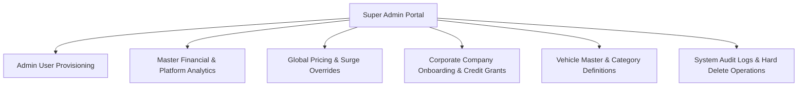
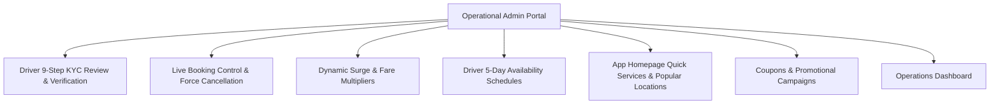
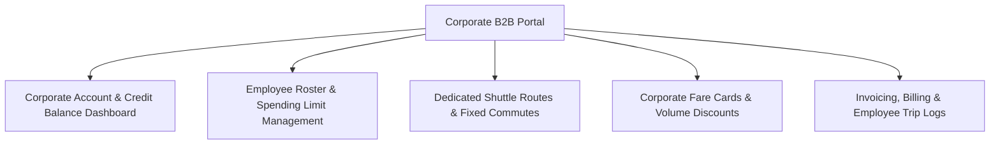

# Strive Platform - Admin Roles & Module Breakdown Specification

This document provides a detailed breakdown of the **Admin Panel Modules** categorized by user role: **Super Admin**, **Operational Admin**, and **Company Admin (Corporate B2B Portal)** for the Strive Mobility & Transport Platform.

---

## 📊 Role & Module Summary Matrix

| Feature / Module Category | 👑 Super Admin | 🛡️ Operational Admin | 🏢 Company Admin (B2B) |
| :--- | :---: | :---: | :---: |
| **Admin User & Role Provisioning** | ✅ Full Access (Create/Delete Admins) | ❌ Restricted | ❌ Restricted |
| **Global System Overrides & Bulk Pricing** | ✅ Full Access | ❌ Restricted (Single rate cards only) | ❌ Restricted |
| **Driver 9-Step Onboarding & Document KYC** | ✅ Full Access | ✅ Full Operational Access | ❌ Restricted |
| **Live Trip Monitoring & Force Cancellations** | ✅ Full Access | ✅ Full Operational Access | 👁️ Company Trips Only |
| **Dynamic Surge (Weather & Traffic Rates)** | ✅ Full Access | ✅ Full Operational Access | ❌ Restricted |
| **Vehicle Types & Homepage Tiles Management** | ✅ Full Access | ✅ Full Operational Access | ❌ Restricted |
| **Coupons & Promo Campaigns** | ✅ Full Access | ✅ Full Operational Access | ❌ Restricted |
| **Hard Delete Operations (Bookings/Drivers)** | ✅ Full Access | ❌ Restricted | ❌ Restricted |
| **Corporate B2B Company Creation** | ✅ Full Access | 👁️ Read-Only / Operational | ❌ Restricted |
| **Employee Roster & Spending Limits** | ✅ Full Access | 👁️ Read-Only / Operational | ✅ Full Access (Own Company) |
| **Dedicated Shuttle Routes & Rider Schedules** | ✅ Full Access | ✅ Operational Support | ✅ Full Access (Own Company) |
| **Corporate Credit Balance & Billing** | ✅ Full Access | 👁️ View Balance | ✅ Full Access (Own Company) |

---

## 1. 👑 Super Admin Panel Modules (Root / Owner Level)

The **Super Admin** role (`SUPER_ADMIN`) represents the platform owner and executive system administrators. Super Admins have unrestricted authority over system governance, security, financials, and user provisioning.



### Modules Available to Super Admin:

#### 👑 Module 1: Admin Staff Provisioning & Role Management
* **Description**: Create, manage, and revoke access for internal staff members and sub-admins.
* **Key Capabilities**:
  * Create new `ADMIN` or `SUPER_ADMIN` accounts (`POST /api/v1/admin/users`).
  * Assign role-based permissions (Customer Support, KYC Reviewer, Operations Lead).
  * Activate / Deactivate admin staff credentials.

#### 👑 Module 2: Master Financial & Executive Analytics
* **Description**: High-level platform health, financial metrics, and executive KPIs.
* **Key Capabilities**:
  * View total platform revenue, daily revenue, and commission share (`GET /api/v1/admin/dashboard/stats`).
  * View platform-wide ride volume trends (Completed, Cancelled, In-Trip).
  * Monitor driver payout balances and total corporate credit balances.

#### 👑 Module 3: Global System Overrides & Bulk Rate Engine
* **Description**: Execute platform-wide pricing overrides during peak demand, holidays, or emergency situations.
* **Key Capabilities**:
  * Execute bulk fare updates across all vehicle types simultaneously (`PUT /api/v1/admin/fare-configs/bulk`).
  * Override global base fares, distance per-KM rates, and platform commission percentages.

#### 👑 Module 4: Corporate B2B Company Onboarding & Governance
* **Description**: Register new B2B corporate client accounts and manage credit terms.
* **Key Capabilities**:
  * Create corporate company profiles (`POST /api/v1/companies`).
  * Manage GST, tax identification, and corporate contract documents.
  * Adjust corporate credit lines, deposit balances, and billing payment cycles.

#### 👑 Module 5: Vehicle Master & Category Definitions
* **Description**: Manage core vehicle categories operating on the platform (Cabs, Autos, Bikes, Luxury Buses, Trucks).
* **Key Capabilities**:
  * Add new vehicle type categories (`POST /api/v1/admin/vehicle-types`).
  * Modify passenger/weight limits, icon URLs, and category status.
  * Permanently deactivate or delete vehicle categories (`DELETE /api/v1/admin/vehicle-types/{id}`).

#### 👑 Module 6: System Audit & Hard Delete Operations
* **Description**: High-risk administrative actions and audit logging.
* **Key Capabilities**:
  * Permanently delete booking records (`DELETE /api/v1/admin/bookings/{id}`).
  * Delete driver registration applications (`DELETE /api/v1/admin/driver-registrations/{id}`).
  * Inspect security access logs and trace admin API actions.

---

## 2. 🛡️ Operational Admin Panel Modules (Daily Operations Staff)

The **Operational Admin** role (`ADMIN`) is designed for day-to-day operations teams, customer support leads, driver verification officers, and dispatch coordinators.



### Modules Available to Operational Admin:

#### 🛡️ Module 1: Driver Onboarding & 9-Step KYC Review
* **Description**: Primary workspace for inspecting, verifying, and approving driver registration applications.
* **Key Capabilities**:
  * List applications by status (`SUBMITTED`, `IN_REVIEW`, `DRAFT`) (`GET /api/v1/admin/driver-registrations`).
  * Inspect complete 9-step registration data (Personal Info, Address, Aadhaar, PAN, DL, RC, Insurance, PUC, Bank details) (`GET /api/v1/admin/driver-registrations/{id}`).
  * Verify or reject individual KYC documents with custom rejection reasons (`POST /api/v1/admin/driver-registrations/{id}/verify-document`).
  * Grant final registration approval or issue overall rejection (`POST /api/v1/admin/driver-registrations/{id}/review`).

#### 🛡️ Module 2: Live Booking & Dispatch Control
* **Description**: Monitor ongoing rides, assist stranded customers, and resolve dispatch issues.
* **Key Capabilities**:
  * Filter and search active, scheduled, and past trips by booking code, customer, or driver (`GET /api/v1/admin/bookings`).
  * View real-time pickup/drop locations, route progress, and trip status.
  * Force-cancel trips on behalf of customer/driver with documented operational reasons (`POST /api/v1/admin/bookings/{id}/cancel`).

#### 🛡️ Module 3: Dynamic Surge & Environmental Fare Configuration
* **Description**: Adjust pricing multipliers based on real-time traffic and weather conditions.
* **Key Capabilities**:
  * Configure rate cards for individual vehicle types (`POST /api/v1/admin/fare-configs`).
  * Manage Weather Condition Multipliers (Clear, Light Rain, Heavy Rain) (`/api/v1/admin/weather-fares`).
  * Manage Traffic Surge Multipliers (Low, Medium, High, Very High) (`/api/v1/admin/traffic-fares`).

#### 🛡️ Module 4: Driver Availability & Shift Scheduling
* **Description**: Coordinate driver availability for scheduled commutes and corporate shifts.
* **Key Capabilities**:
  * View 5-day availability schedules for specific drivers (`GET /api/v1/admin/riders/{rider_id}/availability-schedule`).
  * Set or update availability status and shift notes (`POST /api/v1/admin/riders/{rider_id}/availability-schedule`).

#### 🛡️ Module 5: App Homepage Content & UI Management
* **Description**: Manage dynamic service options displayed to mobile app customers.
* **Key Capabilities**:
  * Configure dynamic Quick Service tiles (Bike, Auto, Cab, Airport, Corporate) (`/api/v1/admin/quick-services`).
  * Manage featured Popular Destination Locations (Airports, Railway Stations, Tech Parks, Malls) (`/api/v1/admin/popular-locations`).

#### 🛡️ Module 6: Coupons & Marketing Campaigns
* **Description**: Create discount campaigns for user acquisition and retention.
* **Key Capabilities**:
  * Create flat-rate or percentage-based promo codes (`POST /api/v1/admin/coupons`).
  * Set usage limits, minimum fare thresholds, and start/expiry dates.
  * Track coupon redemption counts and campaign effectiveness (`GET /api/v1/admin/coupons`).

#### 🛡️ Module 7: Operations Dashboard Widgets
* **Description**: Real-time operational monitoring.
* **Key Capabilities**:
  * Monitor total online drivers, active rides in progress, completed rides today, and pending KYC verification queue (`GET /api/v1/admin/dashboard/stats`).

---

## 3. 🏢 Company Admin Panel Modules (Corporate B2B Portal)

The **Company Admin** role (`COMPANY_ADMIN`) is designed for HR Managers, Mobility Leads, and Travel Desk Coordinators at corporate client organizations using Strive B2B services.



### Modules Available to Company Admin:

#### 🏢 Module 1: Corporate Profile & Credit Balance Dashboard
* **Description**: Corporate overview page for tracking account status and prepaid funds.
* **Key Capabilities**:
  * View company profile details, tax/GST registration info, and active status (`GET /api/v1/companies/{id}`).
  * Track real-time prepaid credit balance and current month expenditure.
  * View corporate account admin contacts.

#### 🏢 Module 2: Employee Roster & Commute Budget Management
* **Description**: Control which company employees are eligible to book corporate rides on the company account.
* **Key Capabilities**:
  * Add employees by phone number and employee code (`POST /api/v1/companies/{id}/employees`).
  * Set monthly spending limits per employee (e.g., ₹5,000 / month).
  * Auto-link employees upon mobile OTP verification (`POST /api/v1/auth/verify-otp`).
  * Update employee spending caps or revoke corporate ride privileges (`PUT` / `DELETE /api/v1/companies/{id}/employees/{employee_id}`).
  * View complete employee roster and active status (`GET /api/v1/companies/{id}/employees`).

#### 🏢 Module 3: Dedicated Shuttle Routes & Fixed Route Management
* **Description**: Assign dedicated drivers and vehicles to daily employee commute routes (e.g., Metro Station to Office).
* **Key Capabilities**:
  * Associate dedicated drivers and vehicles with fixed corporate routes (`POST /api/v1/companies/{id}/riders`).
  * Define pickup point (`route_from`) and destination point (`route_to`) with exact GPS coordinates.
  * Define contract start and end dates (`start_date`, `end_date`).
  * Set 5-day shift availability schedules for dedicated shuttle drivers (`availability_schedules`).
  * Update or remove dedicated rider route assignments (`PUT` / `DELETE /api/v1/companies/{id}/riders/{rider_assoc_id}`).

#### 🏢 Module 4: Corporate Rate Card & Negotiated Discounts
* **Description**: Inspect agreed corporate pricing structures and per-KM rates.
* **Key Capabilities**:
  * View corporate base fares, per-KM rates, and waiting charges (`CorporateFareConfig`).
  * View active volume discount percentages applied to corporate trips.

#### 🏢 Module 5: Corporate Invoicing & Detailed Trip Logs
* **Description**: Financial reporting and audit logs for accounting teams.
* **Key Capabilities**:
  * View detailed employee ride history (pickup/drop locations, ride date, distance, fare charged).
  * Download monthly GST-compliant tax invoices and billing statements.
  * Track credit top-ups and balance usage history.

---

## 4. Frontend Routing Architecture for Next.js / React.js

To implement these 3 distinct admin experiences cleanly in **React.js / Next.js**, structure the application layout routes using Role-Based Guards:

```
src/
├── app/
│   ├── (auth)/
│   │   └── login/                  # Login page (Supports Super Admin, Admin, Company Admin)
│   │
│   ├── (super-admin)/              # Protected Route Group: Role == 'SUPER_ADMIN'
│   │   ├── layout.tsx              # Root Super Admin Layout (Red Theme / Full Nav)
│   │   ├── admin-users/            # Super Admin Staff Provisioning
│   │   ├── system-config/          # Bulk Fare Overrides & System Settings
│   │   └── companies/              # Corporate Onboarding & Credit Governance
│   │
│   ├── (operational-admin)/        # Protected Route Group: Role == 'ADMIN' or 'SUPER_ADMIN'
│   │   ├── layout.tsx              # Operations Layout (Blue Theme / Ops Nav)
│   │   ├── dashboard/              # Live Stats & Metrics
│   │   ├── kyc-verifications/      # 9-Step Driver Applications Review Table & Modal
│   │   ├── bookings/               # Live Trips Table & Force Cancellation Modal
│   │   ├── pricing-surge/          # Fare Configs, Weather & Traffic Multipliers
│   │   ├── vehicle-types/          # Vehicle Categories Management
│   │   ├── dynamic-ui/             # Quick Service Tiles & Popular Destinations
│   │   └── coupons/                # Promo Campaign Management
│   │
│   └── (corporate-portal)/         # Protected Route Group: Role == 'COMPANY_ADMIN'
│       ├── layout.tsx              # B2B Corporate Portal Layout (Green/Slate Theme)
│       ├── company-profile/        # Account Info & Credit Balance Widget
│       ├── employees/              # Employee Roster, Phone Sync & Spending Limits
│       ├── shuttle-routes/         # Dedicated Rider Route Associations & Schedules
│       └── billing-invoices/       # Employee Ride Statements & Tax Invoices
```

### Route Guard Middleware Example (`middleware.ts`)

```typescript
import { NextResponse } from 'next/server';
import type { NextRequest } from 'next/server';

export function middleware(request: NextRequest) {
  const token = request.cookies.get('admin_access_token')?.value;
  const userRole = request.cookies.get('user_role')?.value; // SUPER_ADMIN, ADMIN, COMPANY_ADMIN
  const { pathname } = request.nextUrl;

  // 1. Unauthenticated Redirect
  if (!token && !pathname.startsWith('/login')) {
    return NextResponse.redirect(new URL('/login', request.url));
  }

  // 2. Super Admin Routes Protection
  if (pathname.startsWith('/super-admin') && userRole !== 'SUPER_ADMIN') {
    return NextResponse.redirect(new URL('/dashboard', request.url));
  }

  // 3. Operational Admin Routes Protection
  if (pathname.startsWith('/kyc-verifications') && !['ADMIN', 'SUPER_ADMIN'].includes(userRole || '')) {
    return NextResponse.redirect(new URL('/company-profile', request.url));
  }

  // 4. Company Admin Portal Protection
  if (pathname.startsWith('/corporate-portal') && userRole !== 'COMPANY_ADMIN') {
    return NextResponse.redirect(new URL('/dashboard', request.url));
  }

  return NextResponse.next();
}
```
