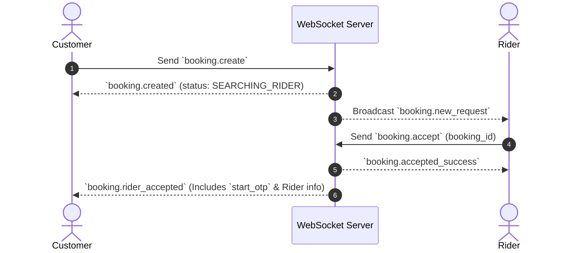
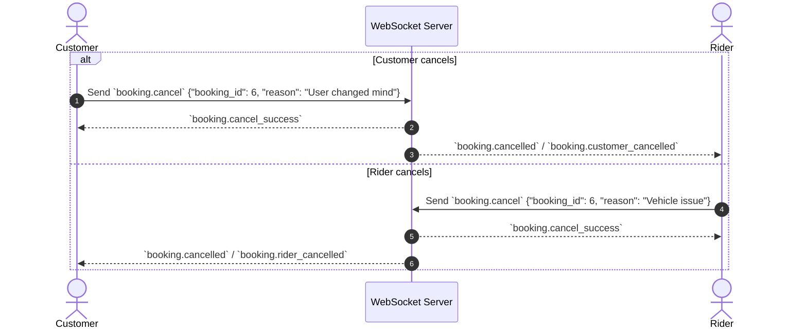

# 📱 Strive Wheels — Complete Frontend WebSocket & REST API Integration Guide

This guide documents the complete WebSocket communication protocol, event payloads, state management, and Dart code implementation for both **Customer App** and **Rider (Driver) App**.

---

## 🔗 WebSocket Endpoints

| Connection Type | Endpoint URL | Parameters |
| :--- | :--- | :--- |
| **Unified Connect** | `wss://api.strive.com/ws/v1/connect` | `?token=<JWT_ACCESS_TOKEN>` |
| **Customer Specific** | `wss://api.strive.com/ws/customer/{user_id}` | `?token=<JWT_ACCESS_TOKEN>` |
| **Driver Specific** | `wss://api.strive.com/ws/driver/{driver_id}` | `?token=<JWT_ACCESS_TOKEN>` |

---

## 📡 Complete Event Specification Matrix

| Event Name | Direction | Sent By | Description / Payload Summary |
| :--- | :---: | :---: | :--- |
| `booking.create` | Client ➔ Server | Customer | Send booking request over WS (`pickup_lat`, `drop_lat`, etc.). |
| `booking.created` | Server ➔ Client | Server | Response to customer with created `booking` object. |
| `booking.new_request` | Server ➔ Client | Server | Incoming ride request broadcast to eligible drivers in 20km. |
| `booking.accept` | Client ➔ Server | Rider | Rider accepts ride (`booking_id`). |
| `booking.accepted_success` | Server ➔ Client | Server | Confirmation sent to winning rider. |
| `booking.rider_accepted` | Server ➔ Client | Server | Sent to Customer with driver details & 4-digit `start_otp`. |
| `rider.location` | Client ➔ Server | Rider | Rider sends live GPS pings (`lat`, `lng`). |
| `rider.location_ack` | Server ➔ Client | Server | Acknowledgment sent back to rider. |
| `rider.location_updated` | Server ➔ Client | Server | **Auto-streamed to active Customer** for map tracking. |
| `booking.cancel` | Client ➔ Server | Either | Send cancellation request (`booking_id`, `reason`). |
| `booking.cancel_success` | Server ➔ Client | Server | Sent to caller confirming cancellation. |
| `booking.cancelled` | Server ➔ Client | Server | Broadcast to Customer/Rider when ride is cancelled. |
| `booking.request_cancelled` | Server ➔ Client | Server | Broadcast to dispatched pending riders to close request modal. |

---

## 🔄 1. Ride Booking & Matching Flow



### Payloads

#### `booking.create` (Customer ➔ Server)
```json
{
  "event": "booking.create",
  "data": {
    "service_mode": "NORMAL",
    "booking_mode": "INSTANT",
    "trip_type": "ONE_WAY",
    "vehicle_type_id": 1,
    "pickup_lat": 17.4128678,
    "pickup_lng": 78.3351332,
    "pickup_address": "Financial District, Gandipet",
    "drop_lat": 17.4345546,
    "drop_lng": 78.3866982,
    "drop_address": "Inorbit Mall Cyberabad",
    "payment_method": "CASH"
  }
}
```

#### `booking.rider_accepted` (Server ➔ Customer)
```json
{
  "event": "booking.rider_accepted",
  "data": {
    "booking": {
      "id": 6,
      "booking_code": "BK-20260908-3W97",
      "status": "RIDER_ACCEPTED",
      "start_otp": "9025",
      "pickup_lat": 17.4128678,
      "pickup_lng": 78.3351332,
      "drop_lat": 17.4345546,
      "drop_lng": 78.3866982,
      "estimated_fare": 209.55,
      "rider": {
        "id": 12,
        "full_name": "Ramesh Kumar",
        "phone": "+919876543210",
        "current_lat": 17.4010,
        "current_lng": 78.3200
      }
    }
  }
}
```

---

## 📍 2. Live GPS Location Tracking Flow

* Rider sends location updates every 3 seconds via REST `POST /api/v1/rider/location` or WS `rider.location`.
* **Backend auto-broadcasts** `rider.location_updated` to the active Customer.

```json
{
  "event": "rider.location_updated",
  "data": {
    "booking_id": 6,
    "rider_id": 12,
    "lat": 17.4085,
    "lng": 78.3310
  }
}
```

---

## 🚫 3. Ride Cancellation Flow



#### `booking.cancel` Payload (Client ➔ Server)
```json
{
  "event": "booking.cancel",
  "data": {
    "booking_id": 6,
    "reason": "Driver taking too long"
  }
}
```

#### `booking.cancelled` Payload (Server ➔ Received by App)
```json
{
  "event": "booking.cancelled",
  "data": {
    "booking_id": 6,
    "cancelled_by": "CUSTOMER",
    "reason": "Driver taking too long",
    "booking": {
      "id": 6,
      "status": "CUSTOMER_CANCELLED"
    }
  }
}
```

---

## 🔑 4. Arrival, OTP Verification & Completion

1. **Rider Arrives at Pickup**: `POST /api/v1/rider/bookings/{id}/arrived`
   - Customer UI updates status to **"Driver Arrived"**.
2. **OTP Verification at Pickup**: `POST /api/v1/rider/bookings/{id}/start`
   - Payload: `{"otp": "9025"}`
   - Status transitions to `TRIP_STARTED`.
3. **Trip Completion at Drop**: `POST /api/v1/rider/bookings/{id}/complete`
   - Status transitions to `TRIP_COMPLETED` ➔ `PAYMENT_PENDING`.

---

## 💻 5. Complete Flutter WebSocket Manager Implementation

```dart
import 'dart:async';
import 'dart:convert';
import 'package:flutter/foundation.dart';
import 'package:web_socket_channel/web_socket_channel.dart';

class StriveWebSocketManager {
  static final StriveWebSocketManager _instance = StriveWebSocketManager._internal();
  factory StriveWebSocketManager() => _instance;
  StriveWebSocketManager._internal();

  WebSocketChannel? _channel;
  StreamController<Map<String, dynamic>> _eventController = StreamController.broadcast();
  Timer? _reconnectTimer;
  bool _isConnecting = false;
  String? _wsUrl;
  String? _token;

  Stream<Map<String, dynamic>> get eventStream => _eventController.stream;

  void connect(String wsUrl, String token) {
    _wsUrl = wsUrl;
    _token = token;
    _initConnection();
  }

  void _initConnection() {
    if (_isConnecting || _wsUrl == null || _token == null) return;
    _isConnecting = true;

    try {
      final uri = Uri.parse('$_wsUrl?token=$_token');
      _channel = WebSocketChannel.connect(uri);
      _isConnecting = false;

      _channel!.stream.listen(
        (data) {
          try {
            final Map<String, dynamic> eventData = jsonDecode(data);
            debugPrint('📥 WS Received: ${eventData['event']}');
            _eventController.add(eventData);
          } catch (e) {
            debugPrint('Error parsing WS message: $e');
          }
        },
        onError: (error) {
          debugPrint('WS Connection Error: $error');
          _scheduleReconnect();
        },
        onDone: () {
          debugPrint('WS Connection Closed');
          _scheduleReconnect();
        },
      );
    } catch (e) {
      _isConnecting = false;
      _scheduleReconnect();
    }
  }

  void sendEvent(String event, Map<String, dynamic> data) {
    if (_channel != null) {
      final payload = jsonEncode({'event': event, 'data': data});
      debugPrint('📤 WS Sending: $event');
      _channel!.sink.add(payload);
    }
  }

  void cancelBooking(int bookingId, String reason) {
    sendEvent('booking.cancel', {
      'booking_id': bookingId,
      'reason': reason,
    });
  }

  void updateLocation(double lat, double lng) {
    sendEvent('rider.location', {
      'lat': lat,
      'lng': lng,
    });
  }

  void _scheduleReconnect() {
    _reconnectTimer?.cancel();
    _reconnectTimer = Timer(const Duration(seconds: 5), () {
      debugPrint('Attempting WS reconnection...');
      _initConnection();
    });
  }

  void disconnect() {
    _reconnectTimer?.cancel();
    _channel?.sink.close();
  }
}
```

---

## 🛠 Complete REST Endpoints Quick Reference

| Endpoint | Method | Role | Description |
| :--- | :---: | :---: | :--- |
| `/api/v1/bookings` | `POST` | Customer | Create ride booking |
| `/api/v1/bookings/{id}/cancel` | `POST` | Both | Cancel booking |
| `/api/v1/rider/location` | `POST` | Rider | Send live GPS coordinates |
| `/api/v1/rider/booking-requests/{id}/accept` | `POST` | Rider | Accept ride request |
| `/api/v1/rider/bookings/{id}/arrived` | `POST` | Rider | Mark arrived at pickup |
| `/api/v1/rider/bookings/{id}/start` | `POST` | Rider | Verify OTP & start trip |
| `/api/v1/rider/bookings/{id}/complete` | `POST` | Rider | Complete trip & open payment |
